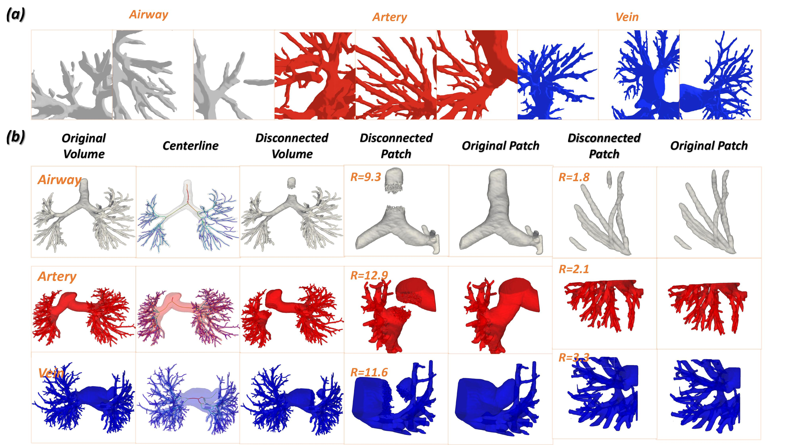

# Pulmonary-Tree-Repairing

[MICCAI'23] Topology Repairing of Disconnected Pulmonary Airways and Vessels: Baselines and a Dataset ([arxiv](https://arxiv.org/abs/2306.07089))

Authors: Ziqiao Weng, Jiancheng Yang, Dongnan Liu, Weidong Cai.

## Abstract

Accurate segmentation of pulmonary airways and vessels is crucial for the diagnosis and treatment of pulmonary diseases. However, current deep learning approaches suffer from disconnectivity issues that hinder their clinical usefulness. To address this challenge, we propose a post-processing approach that leverages a data-driven method to repair the topology of disconnected pulmonary tubular structures. Our approach formulates the problem as a keypoint detection task, where a neural network is trained to predict keypoints that can bridge disconnected components. We use a training data synthesis pipeline that generates disconnected data from complete pulmonary structures. Moreover, the new Pulmonary Tree Repairing (PTR) dataset is publicly available, which comprises 800 complete 3D models of pulmonary airways, arteries, and veins, as well as the synthetic disconnected data.

## Key contributions

- ****Novel Formulation of a Practical Research Problem****: We introduce a new formulation of the problem of pseudo-disconnected pulmonary tubular structures as a keypoint detection task, which is a significant contribution as it has not been extensively explored before.
- **Effective Baseline with Efficient 3D-UNet**: We propose a two-channel 3D neural network that efficiently identifies key points and bridges disconnected components. Our model demonstrates decent performance, providing a strong baseline for future studies.
- **Open-Source Benchmark**: To evaluate the proposed model, we have constructed a new pulmonary dataset named Pulmonary Tree Repairing (PTR), and designed proper metrics for performance examination.

## Dataset



The Pulmonary Tree Repairing (PTR) dataset is available [here](https://onedrive.live.com/?authkey=%21AEq1v5hZHJORzRA&id=66346B2D10575CA6%21252787&cid=66346B2D10575CA6). It consists of the following data splits:

### Data Structure

| Type (airway/artery/vein) | Train  | Validation | Test  |
| --------------------------- | -------- | ------------ | ------- |
| Raw Data                  | 559    | 80         | 160   |
| Synthesized Data          | 16,770 | 2,400      | 4,800 |

For each data type, the dataset includes the following files:

**Raw_data**: airway/raw_data/train/:

```
- pulse_xxxxx_volume.nii.gz: Original binarized volume with 0 representing background and 1 representing airways or vessels. (xxxxx refers to pulse id)
- pulse_xxxxx_centerline.nii.gz: Extracted centerline of the original binarized volume.
- pulse_xxxxx_graph.json: Graph dictionary with edge information for each branch of the pulmonary tree, including location and features of each edge.
```

**Synthesized_data**: airway/synthesized_data/train/:

```
- pulse_xxxxx_idx_volume.nii.gz: Synthesized volume with a single disconnection.
- pulse_xxxxx_idx_kp1_part.nii.gz: Component kp1 of the synthesized volume.
- pulse_xxxxx_idx_kp2_part.nii.gz: Component kp2 of the synthesized volume.
- pulse_xxxxx_idx_data.npz: Meta data of the synthesized volume, including above volumes with corresponding keypoints coordinates and features of the disconnected edge. This is directly laoded into our training pipeline.
```

## Data Synthesis

### Requirements

To set up the required environments, install the following dependencies:

- Numpy:

```
pip install numpy
```

- SimpleITK

```
pip install SimpleITK
```

### Run

To generate synthesized data in bulk for training purposes, run the following command:

```
python data_synthesis.py -source_dir raw_data/ -target_dir synthesized_data/ -volume_num=30 -radius_min=1 -radius_max=15 -points_threshold=10
```

The command line parameters have the following meanings:

* source_dir: Directory of the raw data.
* target_dir: Directory to store the synthesized data.
* volume_num: The number of disconnected volumes to generate for each raw data (original volume).
* radius_min, radius_max: Only edges with a radius within this range will be selected as a disconnected branch.
* points_threshold: Only edges (centerlines) with a point number greater than this threshold will be selected as a disconnected branch.

## To do

- [x] Our Pytorch implementation of keypoint detection will be released soon.

### Citation
If you find this project useful in your research, please cite the following papers:
```
Ziqiao Weng, Jiancheng Yang, Dongnan Liu, Weidong Cai. "Topology Repairing of Disconnected Pulmonary Airways and Vessels: Baselines and a Dataset". The 26th Intl. Conf. on Medical Image Computing and Computer Assisted Intervention (MICCAI), 2023.
```
or using the bibtex:
```
@misc{weng2023topology,
      title={Topology Repairing of Disconnected Pulmonary Airways and Vessels: Baselines and a Dataset}, 
      author={Ziqiao Weng and Jiancheng Yang and Dongnan Liu and Weidong Cai},
      year={2023},
      eprint={2306.07089},
      archivePrefix={arXiv},
      primaryClass={eess.IV}
}
```
